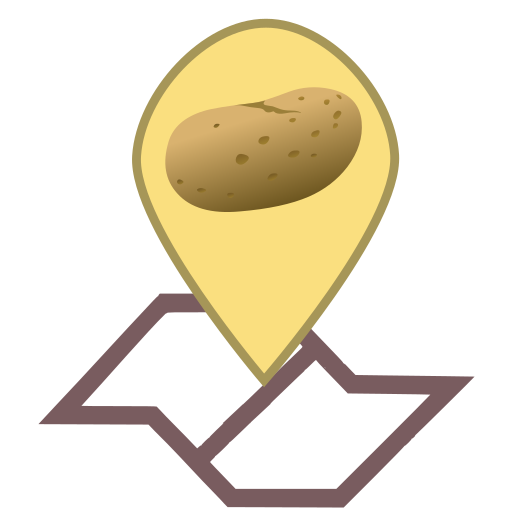

# Cartofeln

Application cartographique utilisée par mes amis et moi pour nos randos en France.
Elle se base sur les services de l'IGN :
  - fonds de carte IGN
  - services accédés via les [extensions Leaflet Géoportail](https://github.com/IGNF/geoportal-extensions) :
    - service de calcul d'itinéraires piétons de l'IGN
    - service de profil altimétrique de l'IGN

Avec un mode position GPS et un mode navigation.

## Roadmap (ouverte aux [suggestions](https://github.com/azarz/cartofeln/issues/new) !!) :
- Amélioration de l'interaction des widgets Géoportail avec l'appli
  - [x] Ne pas supprimer les résultats en fermant les widgets
  - [x] Ajouter l'ajout de points intermédiaires d'itinéraire au menu contextuel
- Ajouts de nouveaux fonds de carte
  - fond OSM
- Enregistrement des itinéraires calculés en local
